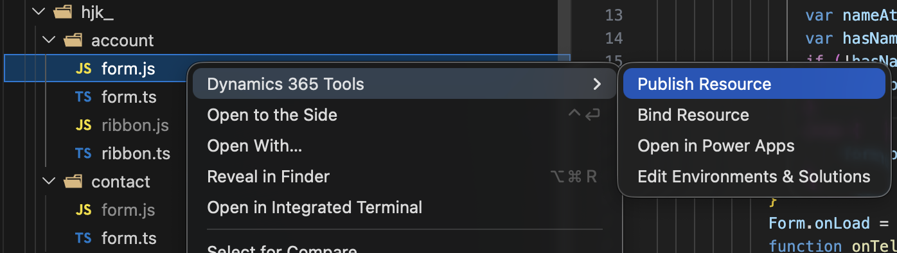
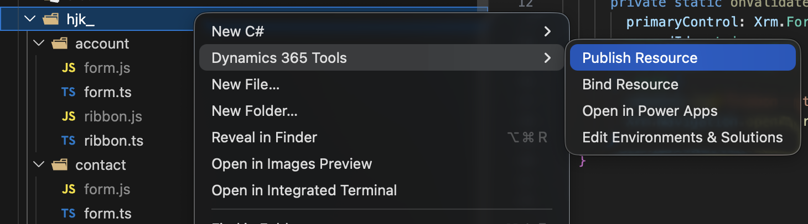
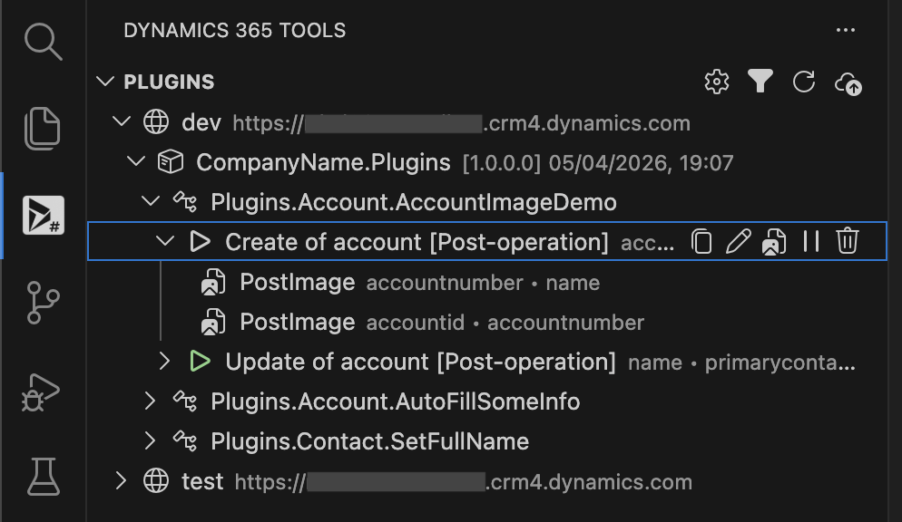
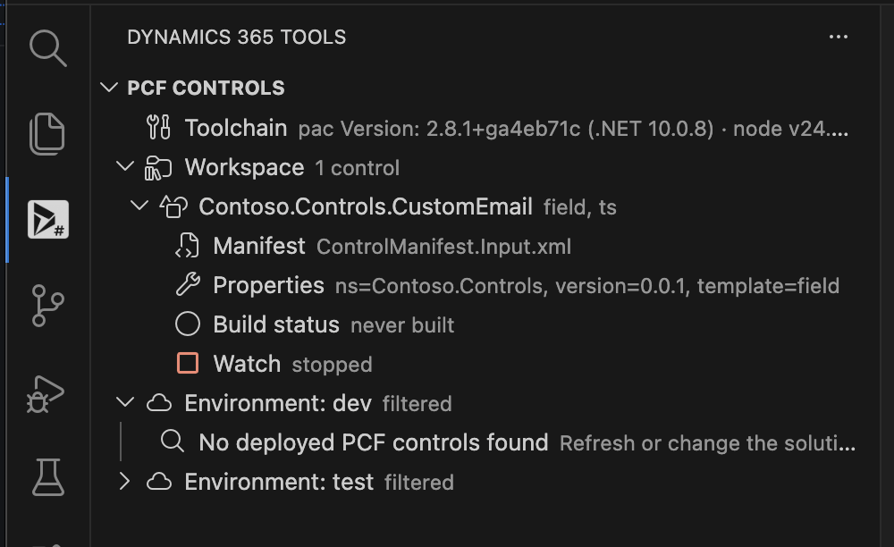
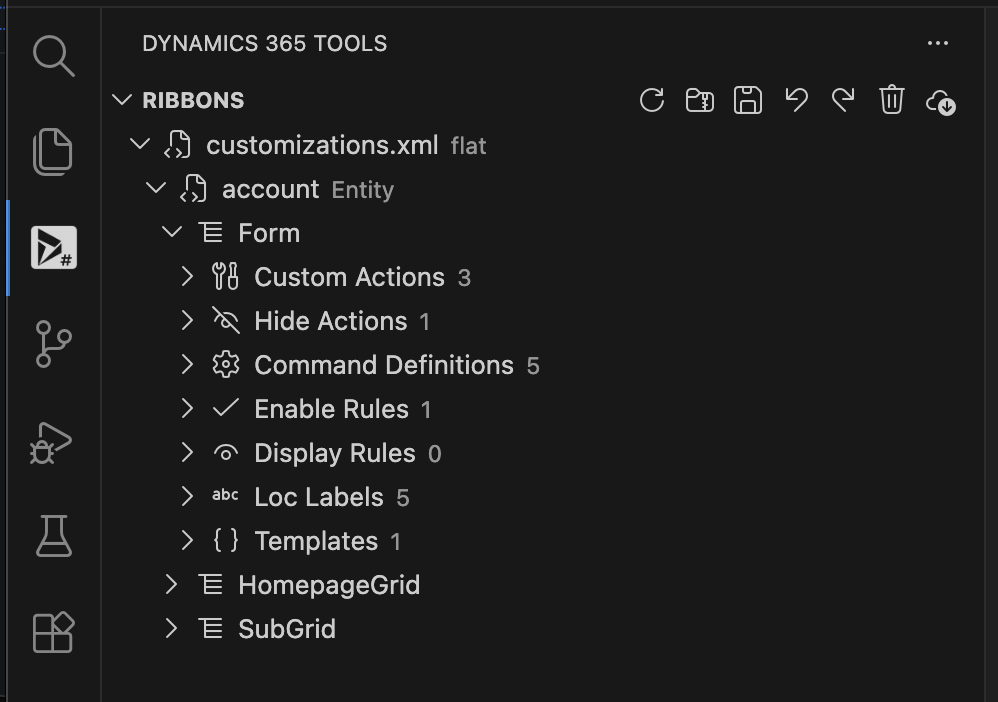
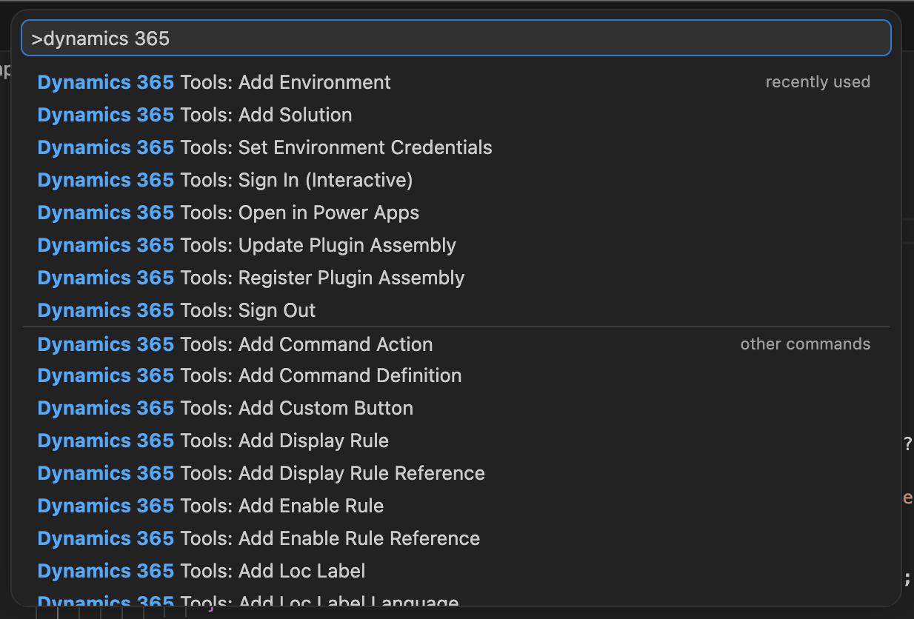

# Dynamics 365 Tools — VS Code Extension

[](https://marketplace.visualstudio.com/items?itemName=oleg-verhoglyad.dynamics-365-tools)
[](https://marketplace.visualstudio.com/items?itemName=oleg-verhoglyad.dynamics-365-tools)
[](LICENSE)

Work with Dynamics 365 (Dataverse) without leaving VS Code. You can publish web resources, manage plugins, build and deploy PCF controls, and edit ribbons. You bind local files to CRM components once, then push updates to one or many environments with a few clicks.

## Table of contents

- [Features](#features)
- [Requirements](#requirements)
- [Install](#install)
- [Views](#views)
- [Configure environments and solutions](#configure-environments-and-solutions)
- [Authenticate](#authenticate)
- [Web resources](#web-resources)
- [Plugins](#plugins)
- [PCF controls](#pcf-controls)
- [Ribbons](#ribbons)
- [All commands](#all-commands)
- [Contributing](#contributing)
- [License](#license)

## Features

- **Publish web resources** from the Explorer with a couple of clicks. No DevOps pipeline needed.
- **Manage plugins** in a tree view: assemblies, plugin types, steps, and images. Register or update assemblies straight from VS Code.
- **Build and deploy PCF controls**: create a new control, build or watch it, push it to an environment, or package it as a solution.
- **Edit ribbons**: add custom buttons, hide or reorder out-of-the-box buttons, add commands and rules, then publish to an environment.
- **Multiple environments**: keep dev, test, and prod side by side and pick the target when you publish.
- **Share settings with the team** through small JSON files in `.vscode/`.
- **Safe credentials**: secrets are kept in VS Code Secret Storage. Interactive sign-in and client secrets are both supported.
- **Fast folder publish**: all supported child files are published, up to 4 at a time. Unchanged files are skipped, and you can cancel any run.
- **Status bar shortcuts** to republish the last web resource or plugin assembly in seconds.

## Requirements

- **VS Code 1.84** or newer.
- **.NET SDK** — needed to register or update plugin assemblies (a small helper reads the plugin types from your `.dll`), to generate a strong name key (uses the `sn` tool), and to package PCF solutions. The `dotnet` command must be on your `PATH`.
- **Power Platform CLI (`pac`)** — needed for PCF commands such as _New PCF Control_ and _Push PCF Control_. See the [install guide](https://learn.microsoft.com/power-platform/developer/cli/introduction).
- **Node.js and npm** — needed to build and watch PCF controls.

You only need the tools for the features you use. For example, web resource publishing works without any of them.

## Install

- Open the **VS Code Marketplace**, search for **“Dynamics 365 Tools”**, and click _Install_.
- Or install a packaged `.vsix` file with _Extensions: Install from VSIX…_.

## Views

The extension adds its own **Dynamics 365 Tools** icon to the Activity Bar. It holds three views:

- **Plugins** — browse and manage plugin assemblies, types, steps, and images.
- **PCF Controls** — see PCF controls in your workspace and the ones deployed to each environment.
- **Ribbons** — open ribbon XML, edit it, and publish it.

Web resource actions (bind, publish, open in Power Apps) live in the **Explorer right-click menu** instead, under `Dynamics 365 Tools`.

## Configure environments and solutions

Create the config by running `Dynamics 365 Tools: Add Environment` or `Dynamics 365 Tools: Sign In (Interactive)`. After that you can edit `.vscode/dynamics365tools.config.json` by hand if you want.

- Add an environment quickly: `Dynamics 365 Tools: Add Environment`.
- Add a solution from Dataverse: `Dynamics 365 Tools: Add Solution`. It loads the unmanaged solutions from the chosen environment and fills in the publisher prefix for you.

```jsonc
{
  "environments": [
    {
      "name": "dev",
      "url": "https://your-dev.crm.dynamics.com",
      "authType": "interactive",
      "manageMissingComponents": true,
    },
    {
      "name": "prod",
      "url": "https://your-prod.crm.dynamics.com",
      "authType": "clientSecret",
      "resource": "https://your-prod.crm.dynamics.com",
      "manageMissingComponents": false,
      "userAgentEnabled": true,
      "userAgent": "Dynamics365Tools-VSCode",
    },
  ],
  "solutions": [
    { "name": "CoreWebResources", "prefix": "publisherPrefix_" },
    { "name": "ComponentWebResources", "prefix": "publisherPrefix_" },
  ],
}
```

Config parameters:

- `environments` (optional, default `[]`): the Dataverse environments you can publish to.
  - `name` (required): a short label shown in the VS Code pickers (for example `dev`, `test`, `prod`).
  - `url` (required): the org base URL (for example `https://contoso.crm.dynamics.com`).
  - `authType` (optional): `interactive` or `clientSecret`. If it is missing, interactive sign-in is tried first.
  - `resource` (optional): a custom token audience or scope base. Use it only when your auth setup needs a different audience than `url`.
  - `manageMissingComponents` (optional, default `false`): when `true`, publishing can create missing web resources and plugin components, and plugin sync can delete plugin types that are not in the assembly. When `false`, only existing components are updated.
  - `userAgentEnabled` (optional, default `false`): adds a `User-Agent` header to the Dataverse and token HTTP calls.
  - `userAgent` (optional): a custom `User-Agent` value. If it is empty and `userAgentEnabled` is `true`, the extension uses `Dynamics365Tools-VSCode/<version>`.
- `solutions` (optional, default `[]`): the Dataverse solutions used for bind, publish, and plugin actions.
  - `name` (required): the solution unique name in Dataverse (for example `CoreWebResources`).
  - `prefix` (required): the web resource prefix used for default paths (for example `new_`, `cmp_`). `Add Solution` saves this from the publisher prefix and makes it end with `_`.
  - `solutionName` (legacy alias): the old key is still accepted and mapped to `name`.

Tips:

- Use `authType: "interactive"` for local work. Use `authType: "clientSecret"` for CI or service accounts.
- If `authType` is not `clientSecret`, the extension can still use stored client credentials as a fallback when interactive sign-in is not available.
- `manageMissingComponents: false` is safer for production: nothing new is created by mistake, but existing components are still updated. Use `true` only for development environments.
- Turn on `userAgentEnabled` only if your proxy, gateway, or audit policy needs a custom client header.

## Authenticate

- **Interactive (default)**: run `Dynamics 365 Tools: Sign In (Interactive)`, then pick a saved authorization or create a new one. The command can create `.vscode/dynamics365tools.config.json` with the selected environment if the file does not exist.
- **Client credentials**: run `Dynamics 365 Tools: Set Environment Credentials`, then pick or create an authorization. The command stores `clientId`, `clientSecret`, and an optional `tenantId` in Secret Storage.
- **Sign out**: run `Dynamics 365 Tools: Sign Out` to clear the interactive session for an environment. You can also remove any stored client credentials for it.

## Web resources

Bind a local file or folder to a CRM web resource once, then publish it whenever you want.

### Supported file types

`.js`, `.css`, `.htm`, `.html`, `.xml`, `.json`, `.resx`, `.png`, `.jpg`, `.jpeg`, `.gif`, `.xsl`, `.xslt`, `.ico`, `.svg`.

The Explorer `Dynamics 365 Tools` menu shows up on these file types and on folders.



### Bind resources

- **From the Explorer**: right-click a file or folder → `Dynamics 365 Tools` → `Bind Resource`.
- **From the Command Palette**: `Dynamics 365 Tools: Bind Resource` (it uses the active file or folder).
- The default remote path uses the publisher prefix of the chosen solution when it matches the local path. You can change it.
- For a folder binding, the extension asks for an environment and compares the local files with the CRM web resources under the target `remotePath`. If the counts are different, you get a short warning before the binding is saved.
- Bindings are saved to `.vscode/dynamics365tools.bindings.json` so the team can share them. Example:

```jsonc
{
  "bindings": [
    {
      "relativeLocalPath": "src/webresources/publisherPrefix_",
      "remotePath": "publisherPrefix_",
      "solutionName": "CoreWebResources",
      "kind": "folder",
    },
    {
      "relativeLocalPath": "src/webresources/publisherPrefix_/contact/form.js",
      "remotePath": "publisherPrefix_/contact/form.js",
      "solutionName": "CoreWebResources",
      "kind": "file",
    },
  ],
}
```

A file binding wins over a folder binding when both cover the same file.

### Publish resources



- In the Explorer, right-click a bound file or folder → `Dynamics 365 Tools` → `Publish Resource` (or run `Dynamics 365 Tools: Publish Resource`). Pick an environment when asked.
- For a bound folder, all supported files inside are published. Up to 4 files go at once, and you can cancel from the progress dialog.
- Unchanged files in a folder publish are skipped, using `.vscode/dynamics365tools.publishCache.json` (based on content hash, size, and modified time).
- **Quick publish**: click the status bar item (cloud upload icon) or run `Dynamics 365 Tools: Publish Last Resource` to publish the most recent file or folder again, with the same environment and binding.
- **Open in Power Apps**: right-click a bound file → `Dynamics 365 Tools` → `Open in Power Apps`, pick the environment, and the extension opens the classic web resource editor for that solution and resource.

## Plugins

Open the **Plugins** view in the Dynamics 365 Tools Activity Bar to browse assemblies → plugin types → steps → images for any configured environment.



**Assemblies**

- `Dynamics 365 Tools: Generate Strong Name Key (Public Key Token)` creates a `.snk` file with the local `sn` tool and shows the public key token for signing.
- `Dynamics 365 Tools: Register Plugin Assembly` uploads a `.dll` to the chosen environment and adds it to your solution.
- `Dynamics 365 Tools: Update Plugin Assembly` replaces the content of an existing assembly with a new `.dll`.
- Plugin and CodeActivity classes are found for you when you register or update an assembly. New plugin types are created only when `manageMissingComponents` is `true`. Existing types are always updated. Types that were removed from the assembly are deleted only when `manageMissingComponents` is `true`. Missing types are deleted before an update, because CRM blocks the update while the old type still points to the assembly.
- **Quick publish**: click the status bar item (package icon) or run `Dynamics 365 Tools: Publish Last Plugin Assembly` to upload the last assembly again, reusing the last environment.
- Use the trash icon next to a plugin type to remove it. Its steps and images are deleted with it.

**Steps and images** (right-click menu or Command Palette)

- Create, edit, enable, disable, or delete plugin steps. Creating a step asks for message, entity, stage, mode, rank, attributes, and solution. Deleting a step also deletes its images first.
- Create, edit, or delete plugin images for a step. The defaults include sensible aliases and message property names.
- Copy step or image details to the clipboard with the inline copy actions.

**Filter**

- Turn on **Show Configured Solutions Only** in the view title to show only the assemblies and types from the solutions in your config. The default solution is skipped automatically.

## PCF controls

Open the **PCF Controls** view to work with PowerApps Component Framework controls. The view shows the controls in your workspace and the controls already deployed to each environment.



> Needs the Power Platform CLI (`pac`) and Node.js/npm. Packaging a solution also needs the .NET SDK. See [Requirements](#requirements).

**Create and build**

- `Dynamics 365 Tools: New PCF Control` scaffolds a new control with `pac`. It asks for the namespace, control name, template (`field` or `dataset`), and framework (TypeScript or React), and can run `npm install` for you. The main source file opens when it is ready.
- `Dynamics 365 Tools: Build PCF Control` runs the production build.
- `Dynamics 365 Tools: Watch PCF Control` rebuilds on every change. Stop it with `Dynamics 365 Tools: Stop PCF Watch`.

**Deploy**

- `Dynamics 365 Tools: Push PCF Control to Environment` does a fast developer deploy with `pac pcf push`. This is the quickest way to test a change.
- `Dynamics 365 Tools: Package PCF Solution (Managed)` or `(Unmanaged)` builds a solution `.zip` you can import or ship.
- `Dynamics 365 Tools: Deploy Last PCF Solution Package` imports the last package you built into a chosen environment.

**From the view (deployed controls)**

- **Update PCF Control from Local Project** pushes your local control that matches the deployed one.
- **Use Deployed PCF Version in Manifest** copies the deployed version number into your `ControlManifest.Input.xml`.
- **Copy PCF Control ID** puts the control ID on the clipboard.

**Filter**

- Filter the deployed controls by your configured solutions, or filter the local controls by workspace folder, from the view title.

## Ribbons

Open the **Ribbons** view to load ribbon XML, edit it visually, and publish it back. You can open a single ribbon XML file, or open the ribbons from a solution `.zip`, or pull them straight from an environment.



**Open and save**

- `Open Ribbon XML` opens a local ribbon XML file.
- `Open Ribbons from Solution...` opens the ribbons inside a solution `.zip`.
- `Pull Ribbons from Environment...` downloads the ribbons from a connected environment.
- The view also finds flat `customizations.xml` files in the workspace, including child folders up to 4 levels deep, for example `Ribbons/new_/account/customizations.xml`.
- `Save Ribbon Changes`, `Undo Ribbon Edit`, and `Redo Ribbon Edit` manage your edits.
- `Save Solution Zip...` writes the changes back to a solution `.zip`.
- `Publish Ribbons to Environment...` sends your changes to an environment.
- `Clean Up Generated Ribbon Solutions...` removes the temporary solutions the publish step creates.

**Preview**

- `Preview Ribbon` opens a visual command-bar preview of a ribbon view or document. Each scope (Home grid, subgrid, form) is drawn as one horizontal command bar: the standard out-of-the-box buttons come from a built-in catalog, your custom buttons are highlighted and slotted in at their sequence, and hidden buttons are struck through. The action is on the view and document items (inline icon and right-click menu) and on the details panel.

**Edit buttons**

- `Add Custom Button` adds your own button to a ribbon.
- `Hide OOB Button` hides an out-of-the-box button. `Hide OOB Buttons and Create Stubs` also creates command stubs you can fill in.
- `Reorder OOB Buttons` changes the order of the built-in buttons.

**Edit commands and rules**

- `Add Command Definition`, `Override OOB Command`, and `Add Command Action` set up what a button does.
- `Add Enable Rule` / `Add Display Rule` create new rules. `Add Enable Rule Reference` / `Add Display Rule Reference` link a command to an existing rule. `Add Rule Step` adds a step inside a rule.
- `Add Loc Label` and `Add Loc Label Language` manage localized labels.
- `Move Ribbon Item Up` / `Down`, `Edit Ribbon Item`, and `Delete Ribbon Item` work on any node in the tree.

**Built-in rules**

The extension ships with common enable rule references: `Mscrm.SelectionCountExactlyOne`, `Mscrm.ShowOnQuickAction`, `Mscrm.ShowOnGrid`, and `Mscrm.ShowOnGridAndQuickAction`.

You can also build custom rules:

- **Enable rules** can check: JavaScript, form state, field value, selection count, record privilege, entity, and command client type.
- **Display rules** can check the same things plus: entity privilege, form type, entity property, miscellaneous privilege, organization setting, tablet experience, relationship type, required referencing attribute, page address, and nested _Or_ groups.

## All commands

Every command is under the `Dynamics 365 Tools:` prefix in the Command Palette (`Ctrl/Cmd + Shift + P`). Many of them also appear in the Explorer right-click menu or in the view title and item menus, so you rarely need to type them.



## Contributing

Issues and pull requests are welcome on [GitHub](https://github.com/olegasd123/dynamics-365-tools).

To build from source:

```bash
npm install
npm run compile   # type-check and bundle
npm test          # run the tests
npm run package   # build the production bundle
```

Before you send a change, please run:

```bash
npm run format
npm run lint
npm test
```

## License

[MIT](LICENSE)
